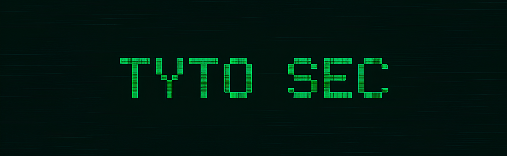

Hello! My name is Victor and my hacker handler is Tyto. Welcome to my Github profile. Here, you'll find a curated collection of security projects, code examples, and experiments that I've worked on throughout my journey.

## 🧑 About Me

I currently work as a Developer I at DB Server. I'm a contractor in the IT Governance team at Sicredi, the first cooperative financial institution in Latin America. 

To get to know better my journey as software developer visit my main github:

- [Github: Victor Silva](https://github.com/victorhfsilva)

Secure development is a area that strongly fascinates me. That's why, in my free time, I'm studying ethical hacking, application security, among other security related subjects.

## 📈 Stats

  

## 📫 Contact

  
  
  

